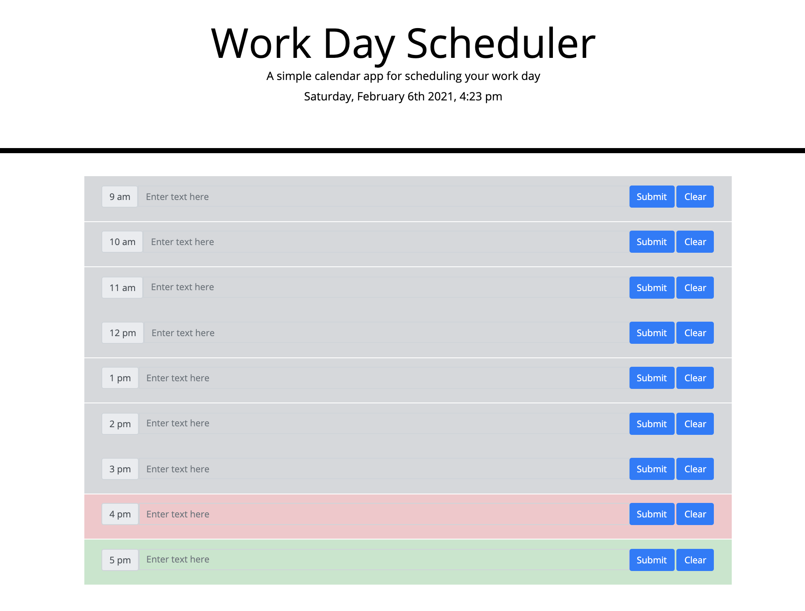
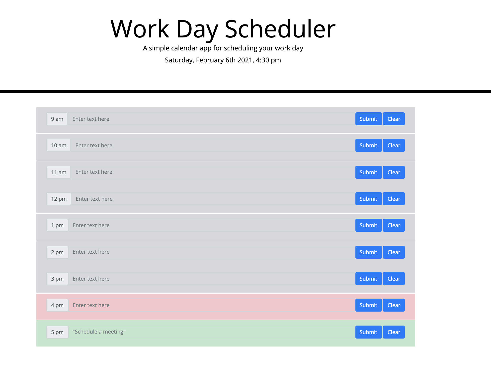

# workDaySchedulerHW5

## Description

This web application is meant to provide a daily planner to create a schedule. When the user opents the planner, the current day is displayed. Underneath that, the user is presented with colour-coded time blocks that indicate which times of the day have already passed, which are upcoming, and which hour is the present hour. If the time has passed the time block is grey, if it is the present time block it is highlighted red, and anything in the future is highlighted green. The user has the ability to type in the timeblocks and save the text in the timeblock. When the page is refreshed, the text typed and entered stays in the local storage. Only when the user presses "clear" is the text removed.  

## Screenshots

This screenshot shows the code untouched by the user. 

This screenshot shows what it looks like when the user saves text in the 5:00 pm time slot.

## Link to deployed application
https://alexgoldman98.github.io/workDaySchedulerHW5/

